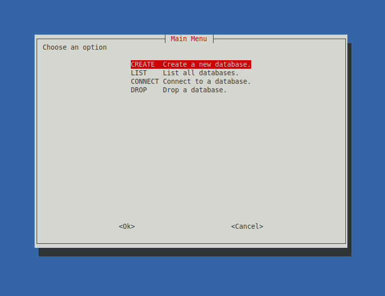

## A simple database management system using bash scripting and whiptail (for gui) running on Linux machines written for Shell Scripting Course (ITI).

  

### :warning: This project isn't completed yet but working, feel free to contribute to this script and make it better.

### To run this script, you need to install "whiptail" first
- To install whiptail on Debian, Ubuntu and Ubuntu-based distros: sudo apt-get install whiptail
- To install whiptail on Fedora: sudo yum install newt
- To install whiptail on Arch: sudo pacman -S newt

### How to run the script:
1. Clone the repo
2. Open the terminal in the repo's directory
3. Run the script using: `./dbms.sh`

### License
 
